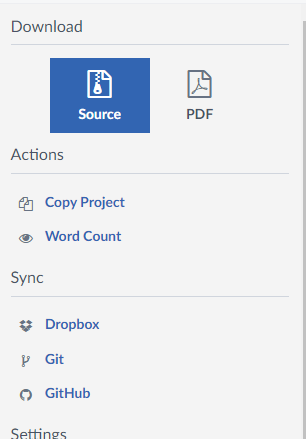

# latex-spell-check
This github repo is an implementation to completely check your entire thesis, dissertation, or report writting in latex. It will check for:
* Evident and spelling mistakes
* Sentence and paragraph structure
* Writing tips

Using GPT4 with the OpenAI API. Expect a large report (10.000 words) to cost around $3-5 to complete.
You can always change the model to a lower cost model.

## Installation
Install python dependencies, use python 3.11 or higher
```python
python -m venv venv
venv/Script/activate
pip install -r requirements.txt
```

## Download from Overleaf
Download the source of your report in overleaf by clicking on the menu button on the top left.
Place the .zip in the `files` directory and unzip it there, order or structure in you files does not matter.




Add files to the variable `blocked_files` if you want to block out any files to be checked. Only the file name, not the path.

## Run
Run `spell_check_latex.py`, results will show up in `spelling_check_{date}.md`